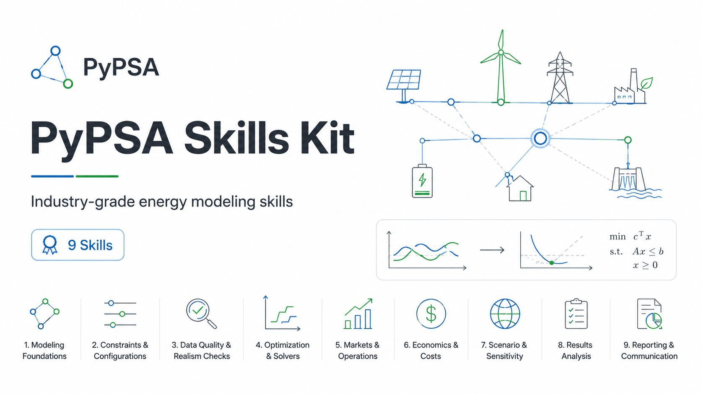

<p align="center">
  
</p>

# PyPSA Skills Kit

Nine industry-grade [Claude Code](https://claude.com/claude-code) skills for [PyPSA](https://pypsa.org) energy system modeling — the judgment layer that isn't in any documentation: which storage representation before you build the wrong one, why your revenue number is 10–30% too optimistic before a lender sees it, what a 5-digit CO2 shadow price actually means, and why turning on unit commitment silently deletes your prices.

Works with vanilla PyPSA **and** workflow frameworks (PyPSA-Eur, PyPSA-Earth).

## Why this kit

- **Deep, not broad.** This is the PyPSA layer. For AC voltage detail, dynamics, protection, or distribution feeders, use an AC-tool suite (e.g. [PowerSkills](https://github.com/Power-Agent/PowerSkills)) — the kit knows its boundary and routes away from non-PyPSA stacks.
- **Every script AND every code snippet is tested.** A suite-level smoke test compiles every bundled script, solves a synthetic network, runs the validator and the figure generator on it, and extracts + executes the fenced linopy recipes from the reference files. Trigger routing is eval-tested: 26-case suite, last full runs 2026-06-11 scored 24-26/26 (LLM-judge variance), adversarial negatives 6/6 rejected every run.
- **Token-efficient by architecture.** ~23k tokens of expertise; a typical task loads ~2.6k (~1.2k always-on index + one skill + one reference) — the other ~90% stays on disk. Verification runs as *code*, not context: the validator is ~3.8k tokens of Python the model never reads — only its ~200-token report enters the conversation.
- **Adversarially reviewed.** Substantive content went through red-team rounds with numeric verification against solved networks (this process caught — among others — a sign inversion in merchant price interfaces and an LP wash-trading trap in multi-market co-optimization before they could mislead anyone).

## Installation

**As a plugin (recommended):**

```bash
claude plugin marketplace add https://github.com/<you>/pypsa-skill   # or a local path
claude plugin install pypsa-skills
```

Skills are then invoked namespaced: `/pypsa-skills:pypsa-solve-and-debug`.

**Per project (no plugin install):** copy the nine skill folders into your project:

```bash
cp -r skills/pypsa-* /path/to/your/project/.claude/skills/
```

Skills are then invoked unnamespaced: `/pypsa-solve-and-debug`.

**Try without installing** (single session):

```bash
claude --plugin-dir /path/to/pypsa-skill
```

> Note: Claude Code does **not** auto-discover the `skills/` folder at repo root — use one of the three methods above.

## Usage

Skills activate two ways:

1. **Automatically** — just describe your problem ("my optimization returns infeasible", "what does this battery earn trading day-ahead and intraday?") and the matching skill loads.
2. **Explicitly** — call one by name with arguments:

```
/pypsa-skills:pypsa-solve-and-debug barrier stalls with numerical difficulties
/pypsa-skills:pypsa-reporting results/networks/solved.nc dispatch + price duration
/pypsa-skills:pypsa-physical-realism my_model.nc
```

## The nine skills

| Skill | The question it answers |
|---|---|
| `pypsa-network-modeling` | How do I build/extend the network correctly? (+ PyPSA-Eur/Earth config-first workflows) |
| `pypsa-sector-coupling` | How do I represent heat, hydrogen, transport, industry? |
| `pypsa-custom-constraints` | How do I express behavior in linopy — and prove it landed? |
| `pypsa-physical-realism` | Is this model physically sane? (executable validator included) |
| `pypsa-market-design` | Is the market representation right? Nodal/zonal, flow-based, reserves, congestion economics |
| `pypsa-asset-economics` | Is this a defensible business case? Foresight/merchant/fee bias corrections, multi-market revenue |
| `pypsa-data-pipelines` | Where do realistic inputs come from? atlite, technology-data, fuel & CO2 prices |
| `pypsa-solve-and-debug` | Why won't it solve, and what do the results mean? |
| `pypsa-reporting` | How do I turn a solved network into figures that double as bug detectors? |

## Suite tooling

```bash
python skills/test_scripts.py     # smoke test: compile + solve + validate + plot (run before release)
python skills/run_evals.py        # trigger-precision evals (LLM judge over the skill descriptions)
python skills/detect_stack.py .   # domain guard: is this project actually PyPSA?
```

## Documentation

- [`skills/README.md`](skills/README.md) — internal architecture: operations-as-skills, JIT token economics, scaling rules, maintenance cadence
- [`skills/NOTATION.md`](skills/NOTATION.md) — contributor guide: the compressed notation, edit rules, sync contracts

## Compatibility

Verified against PyPSA 1.0.7, pandas 2.3, HiGHS 1.13, linopy 0.6, and PyPSA-Eur v2026.02.0. Version-sensitive facts name their version inline.

## License

[MIT](LICENSE)
